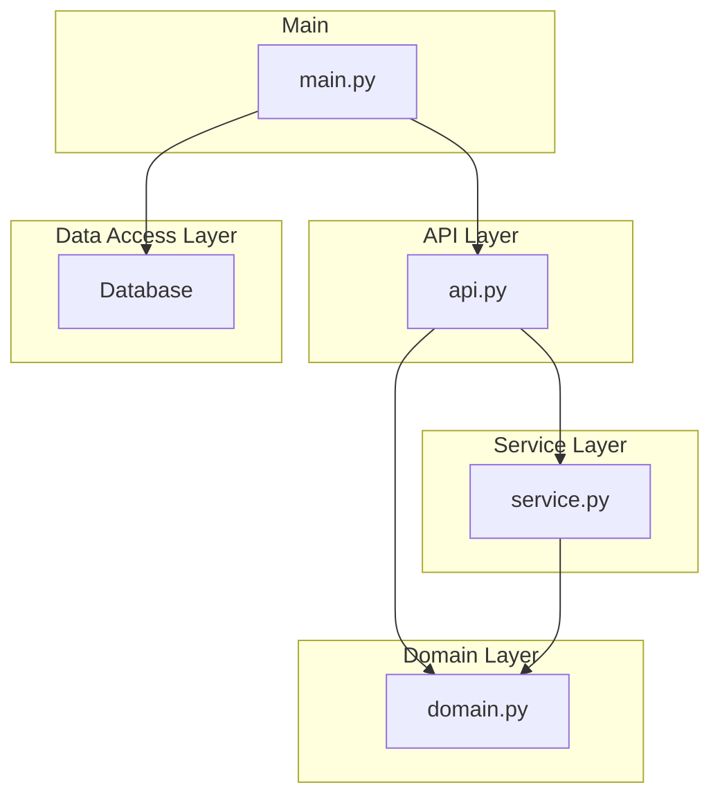

# learn-fastapi
FastAPI 사용법을 익히기 위한 레포지터리

## 요구 사항

- Python 3.9+
- [Poetry](https://python-poetry.org/docs/#installation) 1.4.0+

## 패키지 설치 및 가상 환경 실행

```shell
poetry install
poetry shell
```

## 실행 및 API 테스트

```shell
uvicorn main:app --reload

# Swagger UI
http://127.0.0.1:8000/docs
```

## 레이어드 아키텍쳐

