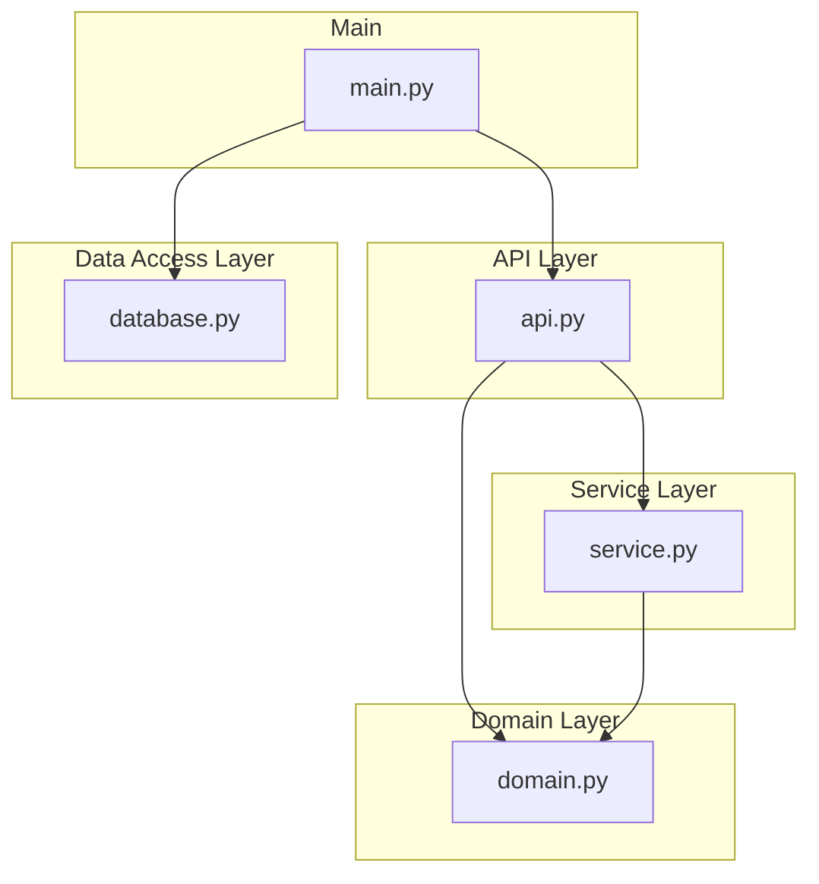

# learn-fastapi
FastAPI 사용법을 익히기 위한 레포지터리

## 요구 사항

- Python 3.9+
- [Poetry](https://python-poetry.org/docs/#installation) 1.4.0+

## 패키지 설치 및 가상 환경 실행

```shell
poetry install
poetry shell

# 코드 일관성을 위해 pre-commit 훅 스크립트 설치
pre-commit install
```

## 실행 및 API 테스트

```shell
uvicorn main:app --reload

# Swagger UI
http://127.0.0.1:8000/docs
```

## 레이어드 아키텍쳐



## GitHub Flow 브랜치 전략 프로세스

1. 브랜치 생성 (네이밍 컨벤션 : feature/add-logic)
2. 코드 커밋 & 푸시
3. PR(Pull Request) 생성 후, 테스트 및 리뷰
4. 병합(Merge) 및 배포(Deploy)
5. 병합 및 배포 완료 된 브랜치는 삭제 

